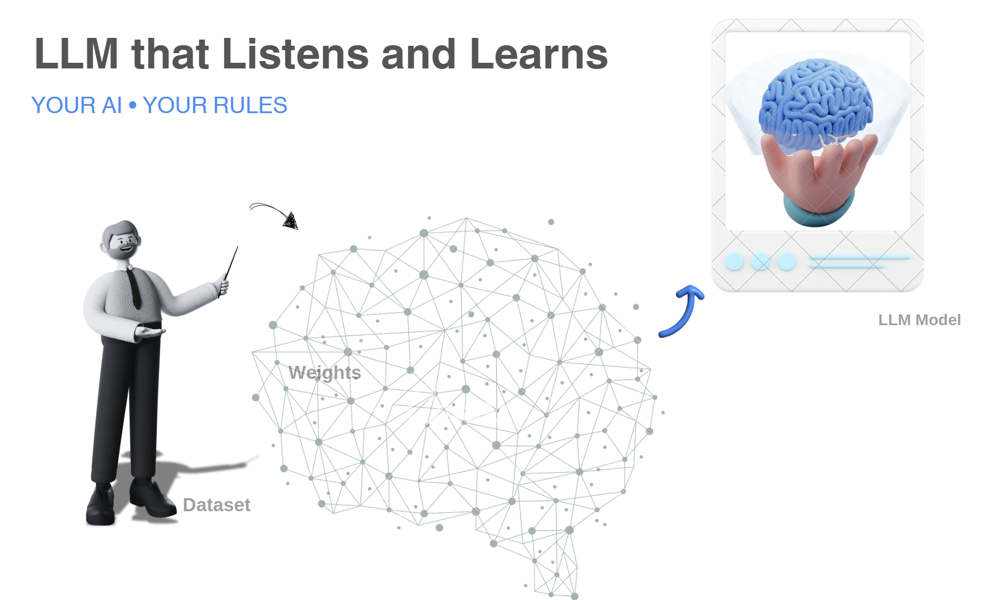
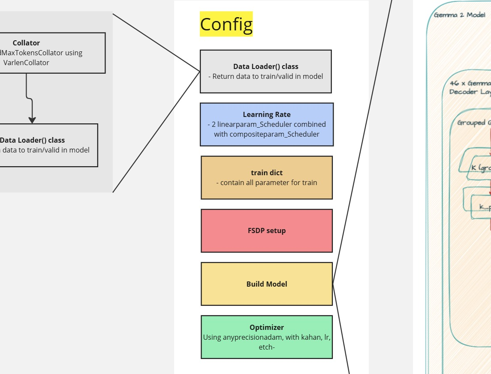
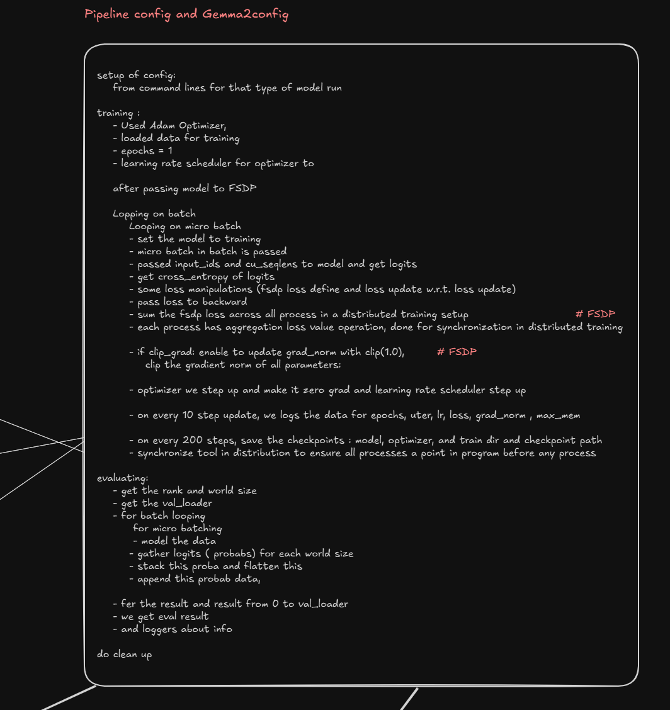

# Efficiently Fine-Tuning LLM Techniques

<!--  -->
<!---->
<!---->



## Contents
- [Efficiently Fine-Tuning LLM Techniques](#efficiently-fine-tuning-llm-techniques)
  - [Contents](#contents)
    - [Dataset Config Workflow](#dataset-config-workflow)
      - [Optimization Data processing 1 : collators](#optimization-data-processing-1--collators)
    - [Train Model Architecture](#train-model-architecture)
      - [Optimization step 1 : Rotary Embeddings](#optimization-step-1--rotary-embeddings)
      - [Optimization step 2 : Attention Layer](#optimization-step-2--attention-layer)
      - [Use Case step 1 : Classification task](#use-case-step-1--classification-task)
      - [Use Case step 2 : Causal Mask](#use-case-step-2--causal-mask)
      - [Use Case step 3 : Sliding Window](#use-case-step-3--sliding-window)
    - [Model Initialization](#model-initialization)
    - [Training Pipeline Config Setup](#training-pipeline-config-setup)
      - [Training step 1 : Optimizers](#training-step-1--optimizers)
      - [Training step 2 : Loss](#training-step-2--loss)
    - [Experiments list](#experiments-list)
  - [Inspiration](#inspiration)

### Dataset Config Workflow

About dataset manipulation:
```python
max_sequence_length = 4096 # after processing data tokenize with this length on text

# on dataloader
batch_size = 80
num_worker = 4
max_token = 1024*16 # when collate the text with the logic of Variable length Collator

```

Data prepared preview:
```json
{
'batch_size': 3, 
'input_ids': tensor([[     2,    106,   1645,  ...,    603, 235292,  15695]]), 
'position_ids': tensor([[   0,    1,    2,  ..., 1948, 1949, 1950]]), 
'seq_lens': [298, 687, 1951], 
'cu_seqlens': tensor([   0,  298,  985, 2936], dtype=torch.int32), 
'max_seq_len': 1951, 
'label': tensor([[1., 0., 0.],
        [1., 0., 0.],
        [1., 0., 0.]]), 

'input_text': ['<bos><start_of_turn>user\nPlease act as an impartial judge and evaluate the quality of the responses provided by two\nAI assistants to the user question displayed below. You should choose the assistant that\nfollows the user’s instructions and answers the user’s question better. Your evaluation\nshould consider factors such as the helpfulness, relevance, accuracy, depth,   ------------------------ progress and adjusting hyperparameters, such as learning rate and regularization, can help mitigate overfitting.\n<|The End of Conversation between a User and two Assistants|><end_of_turn>\n<start_of_turn>model\nverdict is: [['
```

details about Data loader from training dataset file have some this features mentioned below
```python
for batch in tqdm(dataloader):
    for micro_batch in batch:
        # print(micro_batch)
        print(len(micro_batch['input_ids'][0]))
        print(len(micro_batch['position_ids'][0]))
        print(micro_batch['cu_seqlens'])
        print(len(micro_batch['cu_seqlens']))
        print(len(micro_batch['input_text']))
        print(''.join(micro_batch['input_text'][0].split()[-10:])) # last 10 words
        print("------------------------------")
```

Output shows sample
``` json
13316
13316
tensor([    0,  4330,  5251,  6259,  6564,  9577, 10569, 11543, 13001, 13316],
       dtype=torch.int32)
10
9
betweenaUserandtwoAssistants|><end_of_turn><start_of_turn>modelverdictis:[[
------------------------------
16007
16007
tensor([    0,  3097,  3392,  3836,  4784,  5131,  5468,  6478,  6849,  8687,
         8992,  9545, 10015, 10286, 11698, 12612, 13436, 14668, 16007],
       dtype=torch.int32)
19
18
betweenaUserandtwoAssistants|><end_of_turn><start_of_turn>modelverdictis:[[
------------------------------
```

#### Optimization Data processing 1 : collators

#instead standard data loading

#used used `cu_seqlens`
- create a dataset with cumulative sequence lengths , to deal with each input sample having variable length


### Train Model Architecture


```python
Gemma2ForSequenceClassification
(
  (model): Gemma2Model
  (
    (embed_tokens): Embedding(vocab_size = 256000, hidden_size = 2304, padding_idx=0)
    (layers): ModuleList
    (rotary_emb): rotary_emb(head_dim = 256, max_position_embeddings = 8192, emb_shape =)
    (
      (0-25): 26 x Gemma2DecoderLayer
       (input_layernorm): GemmaRMSNorm()
	   (
        (self_attn): Gemma2Attention(
          (q_proj): Linear(in_features=2304, out_features=(num_attention_heads=8)*(head_dim=256), bias=False)
          (k_proj): Linear(in_features=2304, out_features=(num_key_value_heads=4)*(head_dim=256), bias=False)
          (v_proj): Linear(in_features=2304, out_features=(num_key_value_heads=4)*(head_dim=256), bias=False)
          (o_proj): Linear(in_features=(num_attention_heads=8)*(head_dim=256), out_features=2304, bias=False)
          (query_states): GemmaRotaryEmbedding(rotary_emb)
          (key_states): GemmaRotaryEmbedding(rotary_emb)
          (window_size): sliding_window=4096
          (attn_output): flash_attn_varlen_func
          (
	        query_states, key_states, value_states,
	        cu_seqlens_q, cu_seqlens_k,
	        max_seqlens_q, max_seqlens_k,
	        dropout, sofmax_scale((query_pre_attn_scalar=256)**-0.5), casual, window_size, 
	        softcap(attn_logit_softcapping=50) 
          )
        )
       (post_attention_layernorm): GemmaRMSNorm()
       
       hidden_states =  residual + hidden_states
       
       (pre_feedforward_layernorm): GemmaRMSNorm()
	   (mlp): GemmaMLP
	   (
          (gate_proj): Linear(in_features=2304, out_features=(intermediate_size=9216), bias=False)
          (up_proj): Linear(in_features=2304, out_features=(intermediate_size=9216), bias=False)
          (down_proj): Linear(in_features=(intermediate_size=9216), out_features=2304, bias=False)
          (act_fn): ACT2FN(hidden_activation="gelu_pytorch_tanh")
          (out):down_proj(act_fn(gate_proj(x))* up_proj(x))
	   )
        (post_feedforward_layernorm): GemmaRMSNorm()
	
		hidden_states =  residual + hidden_states
     )
    )
    (norm): GemmaRMSNorm(in_features = 2304, eps = 1e-6)
    (gradient_checkpointing): False
    (causal_mask): _update_causal_mask()
  )
  (score): Sequential(
	  (0): Dropout(p=0.1, inplace=False)
	  (1): Linear(in_features=2304, out_features=2304/2, bias=True)
	  (2): Dropout(p=0.1, inplace=False)
	  (3): GELU()
	  (4): Linear(in_features=2304/2, out_features=3, bias=True)
  (logits): score
)

```

#### Optimization step 1 : Rotary Embeddings


#instead of Gemma2RotaryEmbedding
- rotary embedding used in standard from transformers package

#used rotary embedding from transformer Engine:
- initialized with `rotary_emb` calculated using head dim and max position embedding 
- used optimized one from transformer engine

```python
query_states = te.attention.FusedRoPEFunc.apply(query_states, rotary_emb, "thd", cu_seqlns)       
key_states = te.attention.FusedRoPEFunc.apply(key_states, rotary_emb, "thd", cu_seqlens)
```

#### Optimization step 2 : Attention Layer

#instead of Gemma2SdpaAttention:

```python
(self_attn): Gemma2SdpaAttention(
          (q_proj): Linear(in_features=3584, out_features=4096, bias=False)
          (k_proj): Linear(in_features=3584, out_features=2048, bias=False)
          (v_proj): Linear(in_features=3584, out_features=2048, bias=False)
          (o_proj): Linear(in_features=4096, out_features=3584, bias=False)
          (rotary_emb): Gemma2RotaryEmbedding()
        )
```

#used Gemma2Attension where flash attention with variable length function
- it supports soft capping, as used in gemma2 model

#### Use Case step 1 : Classification task

#instead Casual LM
 
#used Sequential for classification


#### Use Case step 2 : Causal Mask

#instead normal update_causal_mask
- uses normal gemma2 with static cache

#used _update_causal_mask_ 

 * The _update_causal_mask_ function is typically used in transformer models to create and update the causal attention mask.
 * This mask ensures that each token can only attend to previous tokens and itself, which is essential for autoregressive models like transformers used in language modeling.

 Role of _update_causal_mask_:
 1. Causal Masking:
- The primary role of _update_causal_mask_ is to create a causal mask that prevents tokens from attending to future tokens.
 - This is crucial for autoregressive models where the prediction of the next token should only depend on the current and previous tokens.

 2. Handling Variable-Length Sequences:
-  The function can handle variable-length sequences by ensuring that the mask correctly reflects the boundaries of each sequence within a batch.
 - This is particularly useful when dealing with packed sequences.

 3. Efficiency:
 - By updating the causal mask dynamically, the function ensures that the attention mechanism operates efficiently, avoiding unnecessary computations on padded tokens.

#### Use Case step 3 : Sliding Window

#instead sliding window transformer logic

#used sliding window for flash attention with variable length

```python
        # disable sliding window in case T4 sdpa implementation does not support it
        # our max input length is slightly longer than 4096
	    # sliding_window is set for 4096 ( its a max length our dataset processing )
        if sliding_window == -1:
            sliding_window = None
        else:
            sliding_window = sliding_window if not bool(layer_idx % 2) else None


        if sliding_window:
            window_size = (sliding_window, sliding_window)
        else:
            window_size = (-1, -1)
```

### Model Initialization

-  _init_weights_ for both type of module, in a gaussian distribution from gemma2config
- std =  0.2 # `initializer_range`
- i added whichever module we have `nn.Linear` or `nn.Embedding` get initialize same normal distribution weights and and handles the padding index by filling zero for embeddings appropriately.

### Training Pipeline Config Setup




#### Training step 1 : Optimizers

#instead optimizers used in all pipeline in Transformer package


#used  any precision Adam Weights Optimizers

- optimizer is instantiated with the specified hyperparameters. with mixed precision level support
- Kahan summation is a technique used to reduce numerical errors in floating-point arithmetic (for numeric stablility)
- used with learning rate update on scheduler

#### Training step 2 : Loss 

#used  Log Loss Buffer

- an efficient way to store and compute the mean of log loss values using a circular buffer.
- particularly useful in training loops where need to track the loss over time and compute running averages `mean`  without storing an ever-growing list of values.

#### Training step 3 : Cross Entropy

#used 
- loss is a measure of the difference between the predicted probability distribution and the true probability distribution.

#### Evaluation step 4 : Classification 

#used 
- F1 score for valuating the training and validating the output dataset

### Experiments list

- [ ] document full chart and fine setup and inference setup on local
- [ ] Model architecture:
  - [ ] Gemma2-9b LLMs from scratch for small dataset
  - [ ] alternative for Collators used in model its have some limitations
  - [ ] https://www.kaggle.com/code/emiz6413/inference-gemma-2-9b-4-bit-qlora
  - [ ] https://www.kaggle.com/code/emiz6413/training-gemma-2-9b-4-bit-qlora-fine-tuning?scriptVersionId=187770530

<!-- 
last i had updated and understood code till the attention middway after rope code need to complete

LIST DOWN all the parameters/ optimizations techniques I'm using in this to have custom pipline

Base image of model and its constructors

1. Flash attention
1.1 flash attention with variable length
2. Transformer engine fusions
3. Weights decays, gradient clipping
4. optimizers schedules

5. GPU why i chooses this gpus, and understand its architecture

etc. check out the example and points from Andrej 4 hr video of GPT 2!


  - [ ] Gemma 2 Fine Tuning for Dummies (with 16k, 32k,... Context) [Full Tutorial] [link](https://www.youtube.com/watch?v=EE-nEecm3Wo)
  - [ ] Github Gemma fine tune [link](https://github.com/nodematiclabs/gemma-fine-tune)
  - [ ] Copy of MOSLEH_finetune_gemma2_DEMO.ipynb [ colablink](https://colab.research.google.com/drive/1jN0gS1Yu19yQRpyJZ-MKIuVAY4zP13Pt)
  - [ ] fine_tuning_tutorial.ipynb by deepmind on gemma [colab link](https://colab.research.google.com/github/google-deepmind/gemma/blob/main/colabs/fine_tuning_tutorial.ipynb#scrollTo=S5F3fk22Ecod)
  - [ ] explore the list and experiments with gaps: 
  - [ ] Paper read : Chatbot Arena: An Open Platform for Evaluating LLMs by Human Preference [Link](https://arxiv.org/html/2403.04132v1)
  - [ ] Judging LLM-as-a-Judge with MT-Bench and Chatbot Arena: [Link](https://ar5iv.org/html/2306.05685#A1.F4) 
    - [ ] Evaluating Large Language Models using LLM-as-a-Judge with Amazon Bedrock [link](https://github.com/aws-samples/evaluating-large-language-models-using-llm-as-a-judge/blob/main/Notebooks/evaluating-large-language-models-using-llm-as-a-judge-with-amazon-bedrock.ipynb)
  - [ ] Other paper and model: [lmsys.org/projects](https://lmsys.org/projects/)
  - [ ] Vicuna: An Open-Source Chatbot Impressing GPT-4 with 90%* ChatGPT Quality [link](https://lmsys.org/blog/2023-03-30-vicuna/) 
- [ ] explore more the pretrained llms on dataset like present on [OpenAI Evals](https://github.com/openai/evals) / [data](https://github.com/openai/evals/tree/main/evals/registry/data)
- [ ] Train model to check the toxic data [toxic-chat](https://huggingface.co/datasets/lmsys/toxic-chat) 
- [ ] MT-Bench (Multi-turn Benchmark) - [link](https://klu.ai/glossary/mt-bench-eval)
- [ ] AlpacaFarm: A Simulation Framework for Methods that Learn from Human Feedback [link](https://github.com/tatsu-lab/alpaca_farm)
- [ ] 
- [ ] -->


## Inspiration

- The dataset to explore [Competition](https://www.kaggle.com/competitions/lmsys-chatbot-arena) and multiple sources from Huggin Face
- Some techniques inspired form here [tascj/kaggle-lmsys-chatbot-arena-post](https://www.kaggle.com/competitions/lmsys-chatbot-arena/discussion/527685) winner's solutions.
