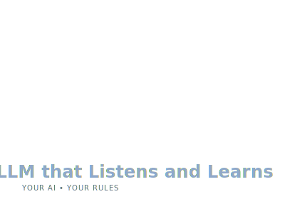

# LLM that Listens and Learns

<!--  -->

<!--  -->

## Contents
- [LLM that Listens and Learns](#llm-that-listens-and-learns)
  - [Contents](#contents)
    - [Experiments list](#experiments-list)
  - [Inspiration](#inspiration)

### Experiments list

- [ ] document full chart and finesetup and inference setup on local
- [ ] Model architecture:
  - [ ] Gemma2-9b and Llama3-8B LLMs from scratch for small dataset
  - [ ] alternative for Collators used in model its have some limitations
<!-- 
  - [ ] Gemma 2 Fine Tuning for Dummies (with 16k, 32k,... Context) [Full Tutorial] [link](https://www.youtube.com/watch?v=EE-nEecm3Wo)
  - [ ] Github Gemma fine tune [link](https://github.com/nodematiclabs/gemma-fine-tune)
  - [ ] Copy of MOSLEH_finetune_gemma2_DEMO.ipynb [ colablink](https://colab.research.google.com/drive/1jN0gS1Yu19yQRpyJZ-MKIuVAY4zP13Pt)
  - [ ] fine_tuning_tutorial.ipynb by deepmind on gemma [colab link](https://colab.research.google.com/github/google-deepmind/gemma/blob/main/colabs/fine_tuning_tutorial.ipynb#scrollTo=S5F3fk22Ecod)
  - [ ] explore the list and experiments with gaps: 
  - [ ] Paper read : Chatbot Arena: An Open Platform for Evaluating LLMs by Human Preference [Link](https://arxiv.org/html/2403.04132v1)
  - [ ] Judging LLM-as-a-Judge with MT-Bench and Chatbot Arena: [Link](https://ar5iv.org/html/2306.05685#A1.F4) 
    - [ ] Evaluating Large Language Models using LLM-as-a-Judge with Amazon Bedrock [link](https://github.com/aws-samples/evaluating-large-language-models-using-llm-as-a-judge/blob/main/Notebooks/evaluating-large-language-models-using-llm-as-a-judge-with-amazon-bedrock.ipynb)
  - [ ] Other paper and model: [lmsys.org/projects](https://lmsys.org/projects/)
  - [ ] Vicuna: An Open-Source Chatbot Impressing GPT-4 with 90%* ChatGPT Quality [link](https://lmsys.org/blog/2023-03-30-vicuna/) 
- [ ] explore more the pretrained llms on dataset like present on [OpenAI Evals](https://github.com/openai/evals) / [data](https://github.com/openai/evals/tree/main/evals/registry/data)
- [ ] Train model to check the toxic data [toxic-chat](https://huggingface.co/datasets/lmsys/toxic-chat) 
- [ ] MT-Bench (Multi-turn Benchmark) - [link](https://klu.ai/glossary/mt-bench-eval)
- [ ] AlpacaFarm: A Simulation Framework for Methods that Learn from Human Feedback [link](https://github.com/tatsu-lab/alpaca_farm)
- [ ] 
- [ ] -->

## Inspiration

- The dataset to explore [Competition](https://www.kaggle.com/competitions/lmsys-chatbot-arena)
- I took this repository from [tascj/kaggle-lmsys-chatbot-arena-post](https://www.kaggle.com/competitions/lmsys-chatbot-arena/discussion/527685), to explore some functionality.